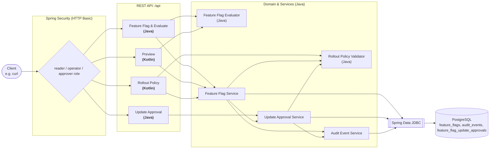
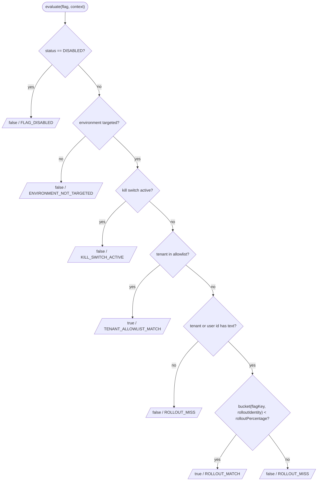
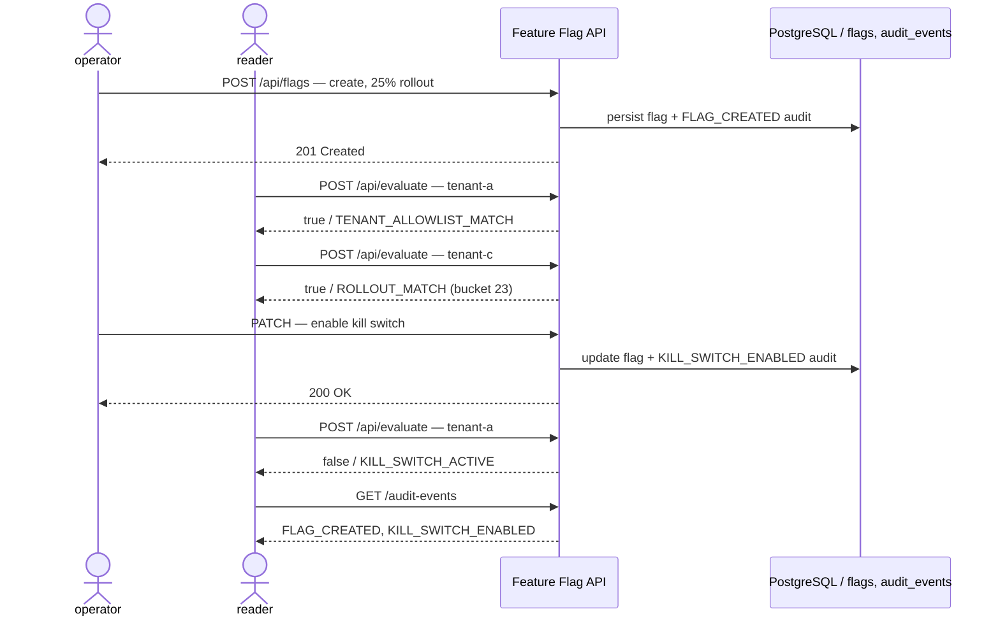

# feature-flag-expt

[English](README.md) | 日本語

[](https://github.com/42milez/feature-flag-expt/actions/workflows/ci.yaml)
[](https://app.codacy.com?utm_source=gh&utm_medium=referral&utm_content=&utm_campaign=Badge_grade)
[](https://app.codacy.com?utm_source=gh&utm_medium=referral&utm_content=&utm_campaign=Badge_coverage)


[](LICENSE)

プロダクト開発チームが基盤の複雑性を意識せず、機能開発という本質的な価値創造に集中できるようにする社内開発者向けプラットフォームを想定し、Spring Boot 製フィーチャーフラグサービスを題材にしたポートフォリオです。フィーチャーフラグ、承認ワークフロー、段階的ロールアウトを組み合わせ、プロダクトチームが「まず作り、価値を確かめながら安全に広げる」探索型のリリースを回せるようにすることを狙いとしています。具体的には、環境ごとのターゲティング、緊急停止用のキルスイッチ、テナント単位の許可リスト、決定的な割合ロールアウト、高リスク変更の承認ワークフロー、監査イベントを扱います。

こうした機能を実装するアプリケーションに加え、コンテナイメージ定義、Kubernetes マニフェスト、オブザーバビリティ、CI 品質ゲートを 1 つのリポジトリにまとめ、プロダクト開発を支えるプラットフォームの構成要素をまとめてレビューできるようにしています。

## 目次

- [このプロジェクトの重点領域](#このプロジェクトの重点領域)
- [アーキテクチャ](#アーキテクチャ)
- [技術スタック](#技術スタック)
- [クイックスタート](#クイックスタート)
- [API 一覧](#api-一覧)
- [設計上の意思決定](#設計上の意思決定)
- [デプロイと運用](#デプロイと運用)
- [オブザーバビリティ](#オブザーバビリティ)
- [開発・セットアップ](#開発セットアップ)
- [リポジトリ構成](#リポジトリ構成)

## このプロジェクトの重点領域

- **アプリケーション設計** — 永続化されるフラグのドメイン、評価ロジック、高リスク変更の更新承認ワークフロー、Spring Data JDBC のトランザクションフロー、監査イベントの記録、Micrometer の計装、Spring Security の境界は Java が担当し、Kotlin は immutable DTO が合う読み取り中心の API 境界に限定しています。([ADR-0008](docs/decisions/0008-use-kotlin-for-evaluation-preview-api.md))
- **Kubernetes マニフェストとデプロイ** — Kustomize の `base` と `dev` オーバーレイを kind にデプロイし、Pod Security Standards の [restricted](https://kubernetes.io/docs/concepts/security/pod-security-standards/#restricted) プロファイルに沿う Pod として実行しています。([ADR-0009](docs/decisions/0009-use-kind-for-local-kubernetes-development-and-ci-validation.md))
- **オブザーバビリティ** — Actuator/Micrometer のメトリクス、ECS JSON の構造化ログ、`promtool` テスト付きの Prometheus アラートルール、Grafana ダッシュボードで、ローカル環境でも挙動を追えるようにしています。([ADR-0011](docs/decisions/0011-keep-observability-stack-alerting-ready-but-local.md))
- **CI 品質ゲート** — フォーマット、Error Prone、ユニットテストと Testcontainers テスト、JaCoCo/Codacy カバレッジ、Kubernetes マニフェストのレンダリング検証、OpenAPI 差分検出、Trivy スキャンを変更ごとに実行します。
- **AI エージェントを活用した開発ワークフロー** — AI エージェントは計画、設計、実装、レビューを支援し、最終的なマージ判断は変更内容を精査した上でリポジトリオーナーが行います。

### 開発アプローチ

典型的な流れは次のとおりです（小さな機能や明確な修正ではロードマップを省略し、設計や実装から始めます）。

1. オーナーが作りたい機能を伝え、AI エージェントが実装フェーズに整理したロードマップを作成します
2. オーナーがロードマップを承認したら、AI エージェントがフェーズごとの設計書を作成します
3. オーナーが設計を承認したら、AI エージェントがその設計書をもとに実装します
4. オーナーが実装をレビューし、問題があれば修正を依頼し、なければマージします

各段階では AI エージェント同士のピアレビューも行います（例: Codex が設計・実装、Claude Code がレビュー）。AI レビューは判断材料の一つであり、オーナーによる最終判断の代わりではありません。

実例は [docs/plans/](docs/plans/README.md) にコミットしています。コードベースの改善をレビューしやすいフェーズに整理したロードマップと、AI エージェントのピアレビューを経て実装に進んだ Phase 2 の設計書です。

## アーキテクチャ

フラグのドメイン、評価ロジック、永続化、更新承認ワークフロー、監査の振る舞いは Java で実装しています。Kotlin は、null 安全な型とデフォルト値で DTO を簡潔に表現できる、プレビューやロールアウトポリシー検証のような読み取り中心の API 境界に限定して使っています。プレビュー API では、変更案、サンプルごとの before/after 差分、集計を Kotlin のネストしたリクエスト/レスポンス DTO で表し、Java の `FeatureFlagEvaluator` を再利用します。ロールアウトポリシー検証 API は Kotlin のコントローラー/サービス層で現在のフラグと変更案を組み立て、Java の validator で検証します。検証結果のレスポンス DTO は、検証 API と PATCH 更新時のポリシー違反レスポンスで共有するため Java record としています。



評価は次の順にチェックを適用し、最初に一致したものを結果の `reason` として返します。



> `bucket` は `SHA-256(flagKey + ":" + rolloutIdentity)` の先頭 4 バイトを符号付きビッグエンディアン整数として読み取り、`floorMod(..., 100)` で `[0, 100)` に落とし込んだ値です。`rolloutIdentity` には tenant ID があればそれを使い、なければ user ID を使います。同じフラグキーと `rolloutIdentity` の組み合わせは常に同じバケットに入るため、リクエストごとにランダムになるのではなく、安定した決定的なロールアウトになります。

## 技術スタック

| 領域 | 主要技術 | 補足 |
|---|---|---|
| 言語 | Java 25 / Kotlin 2.3 | — |
| フレームワーク | Spring Boot 4.1 | Web MVC・Security・Validation・Actuator |
| 永続化 | Spring Data JDBC + PostgreSQL 16 | Flyway マイグレーション |
| API ドキュメント | springdoc-openapi 3.0 | コミット済み OpenAPI スナップショット |
| ビルド | Gradle（multi-stage Docker build） | distroless・非 root の `java25` イメージ |
| デプロイ | Kubernetes + Kustomize | kind クラスター |
| テスト | JUnit・Mockito・MockK・Testcontainers（PostgreSQL） | Spring Security Test |
| 品質 | Spotless（google-java-format / ktfmt）・Error Prone | JaCoCo・Codacy |
| CI | GitHub Actions | Trivy・promtool |
| オブザーバビリティ | Micrometer + Prometheus | ECS JSON ログ・Grafana |

厳密なバージョン番号は [`gradle/libs.versions.toml`](gradle/libs.versions.toml) で管理しています。

## クイックスタート

Docker Compose でアプリケーションを起動し、このあとの手順で基本的な動作を確認していきます。ローカル開発の詳しい手順については [docs/development.ja.md](docs/development.ja.md) を参照してください。

以下の手順はこの流れに沿って進みます。operator と reader は異なる場面で操作し、状態を変える呼び出しはそれぞれ監査イベントを残します。



**1. ローカルの Compose スタックを起動する**

```bash
docker compose up --build -d
```

Compose は Spring Boot の jar 生成を含めて Docker イメージをビルドし、アプリケーションと PostgreSQL を起動します。

**2. フラグを作成し、評価する**

```bash
# 作成: production を対象、tenant-a を許可リストに、25% ロールアウト（operator ロール）
curl -u featureflags-operator:featureflags-operator \
  -H 'Content-Type: application/json' \
  -d '{"flagKey":"checkout-redesign","status":"ENABLED","targetEnvironments":["production"],"killSwitchActive":false,"tenantAllowlist":["tenant-a"],"rolloutPercentage":25}' \
  http://localhost:8080/api/flags
```

```jsonc
// 201 Created
{
  "flagKey": "checkout-redesign",
  "status": "ENABLED",
  "targetEnvironments": ["production"],
  "killSwitchActive": false,
  "tenantAllowlist": ["tenant-a"],
  "rolloutPercentage": 25
}
```

```bash
# production + tenant-a の文脈で評価（reader ロール）
curl -u featureflags-reader:featureflags-reader \
  -H 'Content-Type: application/json' \
  -d '{"flagKey":"checkout-redesign","environment":"production","tenantId":"tenant-a"}' \
  http://localhost:8080/api/evaluate
```

```jsonc
// 200 OK — tenant-a は許可リストに含まれるため、割合ロールアウトの手前で確定する。
// ロールアウトロジックに到達しないので bucket は null。
{
  "flagKey": "checkout-redesign",
  "enabled": true,
  "reason": "TENANT_ALLOWLIST_MATCH",
  "bucket": null
}
```

```bash
# production + tenant-c の文脈で評価（許可リスト外、25% ロールアウト）
curl -u featureflags-reader:featureflags-reader \
  -H 'Content-Type: application/json' \
  -d '{"flagKey":"checkout-redesign","environment":"production","tenantId":"tenant-c"}' \
  http://localhost:8080/api/evaluate
```

```jsonc
// 200 OK — tenant-c は許可リスト外だが、決定的バケット 23 が 25 未満なので有効。
{
  "flagKey": "checkout-redesign",
  "enabled": true,
  "reason": "ROLLOUT_MATCH",
  "bucket": 23
}
```

`enabled`、`reason`、`bucket` により、呼び出し側はフラグ設定の内部構造を知らずに機能を切り替えられます。評価理由はメトリクスや構造化ログにも残るため、許可リスト、キルスイッチ、段階的ロールアウトのどれで判定されたかを運用時に追跡できます。

**3. 緊急キルスイッチを作動させ、監査証跡を確認する**

状態変更はすべてアクター付きで記録されます。ここではキルスイッチを作動させ、評価が一括で無効になる様子と、その操作が監査証跡に残る様子を確認します。

```bash
# 緊急停止: キルスイッチを有効化（operator ロール、PATCH）
curl -u featureflags-operator:featureflags-operator -X PATCH \
  -H 'Content-Type: application/json' \
  -d '{"killSwitchActive":true}' \
  http://localhost:8080/api/flags/checkout-redesign
```

```jsonc
// 200 OK — killSwitchActive が true に。他フィールドは部分更新で保持される。
{
  "flagKey": "checkout-redesign",
  "status": "ENABLED",
  "targetEnvironments": ["production"],
  "killSwitchActive": true,
  "tenantAllowlist": ["tenant-a"],
  "rolloutPercentage": 25
}
```

```bash
# 許可リスト内の tenant-a を再評価（reader ロール）
curl -u featureflags-reader:featureflags-reader \
  -H 'Content-Type: application/json' \
  -d '{"flagKey":"checkout-redesign","environment":"production","tenantId":"tenant-a"}' \
  http://localhost:8080/api/evaluate
```

```jsonc
// 200 OK — 許可リストより前にキルスイッチを評価するため、許可リスト内の tenant-a でも無効になる。
{
  "flagKey": "checkout-redesign",
  "enabled": false,
  "reason": "KILL_SWITCH_ACTIVE",
  "bucket": null
}
```

```bash
# 監査証跡を確認（reader ロール、古い順）
curl -u featureflags-reader:featureflags-reader \
  http://localhost:8080/api/flags/checkout-redesign/audit-events
```

```jsonc
// 200 OK — すべての変更が認証済みアクター付きで記録される。details は eventType ごとに形が変わる。
[
  {
    "id": 1,
    "flagKey": "checkout-redesign",
    "eventType": "FLAG_CREATED",
    "actor": "featureflags-operator",
    "details": { /* ... */ },
    "occurredAt": "2026-..."
  },
  {
    "id": 2,
    "flagKey": "checkout-redesign",
    "eventType": "KILL_SWITCH_ENABLED",
    "actor": "featureflags-operator",
    "details": {
      "field": "killSwitchActive",
      "oldValue": false,
      "newValue": true
    },
    "occurredAt": "2026-..."
  }
]
```

`actor` はリクエストボディではなく認証済みプリンシパルから記録されるため、証跡を偽装できません。本番露出の拡大や、本番ロールアウトを 50 ポイント以上引き上げるような高リスク変更は、代わりに承認ワークフロー（operator が依頼し、approver が判断）を通ります（実行可能な手順は [承認ワークフローの手順](docs/development.ja.md#クイックスタートフル) を参照）。全エンドポイントは **`http://localhost:8080/swagger-ui.html`** で対話的に確認できます。

**4. ローカルスタックを停止する**

```bash
docker compose down
```

## API 一覧

| メソッド | パス | ロール | 用途 | 実装 |
|---|---|---|---|---|
| `POST` | `/api/flags` | operator | フラグの作成 | Java |
| `GET` | `/api/flags/{flagKey}` | reader / operator | フラグの取得 | Java |
| `PATCH` | `/api/flags/{flagKey}` | operator | フラグの更新 | Java |
| `POST` | `/api/flags/{flagKey}/approval-requests` | operator | 高リスク更新の承認リクエスト作成 | Java |
| `GET` | `/api/flags/{flagKey}/approval-requests/{approvalId}` | operator / approver | 承認リクエストの取得 | Java |
| `POST` | `/api/flags/{flagKey}/approval-requests/{approvalId}/approve` | approver | 更新リクエストの承認 | Java |
| `POST` | `/api/flags/{flagKey}/approval-requests/{approvalId}/reject` | approver | 更新リクエストの却下 | Java |
| `POST` | `/api/evaluate` | reader / operator | 文脈に基づくフラグの評価 | Java |
| `GET` | `/api/flags/{flagKey}/audit-events` | reader / operator | 監査イベントの一覧 | Java |
| `POST` | `/api/flags/{flagKey}/preview` | reader / operator | 変更案のプレビュー | Kotlin |
| `POST` | `/api/flags/{flagKey}/validate-change` | reader / operator | 変更案のロールアウトポリシー検証 | Kotlin |

**運用エンドポイント**

| パス | アクセス |
|---|---|
| `/actuator/health`（`/liveness`、`/readiness`） | 公開（プローブ用） |
| `/actuator/prometheus` | 認証必須 |
| `/swagger-ui.html`、`/v3/api-docs(.yaml)` | 公開 |
| その他の `/api/**` | 拒否（フェイルクローズ） |

生の OpenAPI 仕様は `/v3/api-docs`（JSON）と `/v3/api-docs.yaml`（YAML）で提供され、静的スナップショットを [docs/openapi.yaml](docs/openapi.yaml) にコミットしています。

## 設計上の意思決定

重要な意思決定は、MADR v4 形式の [Architecture Decision Records](docs/decisions/README.md) として記録しています。代表的なものは以下のとおりです。

- [ADR-0002](docs/decisions/0002-use-spring-data-jdbc-instead-of-jpa.md) — JPA/Hibernate ではなく Spring Data JDBC を採用
- [ADR-0009](docs/decisions/0009-use-kind-for-local-kubernetes-development-and-ci-validation.md) — ローカル Kubernetes と CI 検証に kind を採用
- [ADR-0010](docs/decisions/0010-use-http-basic-for-local-portfolio-security-boundary.md) — ローカルのセキュリティ境界に HTTP Basic を採用

すべての記録は[インデックス](docs/decisions/README.md)を参照してください。

## デプロイと運用

ローカルでの実行・開発手順の詳細は [docs/development.ja.md](docs/development.ja.md) にまとめています。

### 継続的インテグレーション

GitHub Actions は 3 つのワークフローを使用します。

| ワークフロー | トリガー | 対象 |
|---|---|---|
| `CI` | `main` への push、プルリクエスト、手動実行 | フォーマット、Error Prone コンパイル、ユニットテスト、Testcontainers 統合テスト、JaCoCo カバレッジレポート生成、Kubernetes マニフェストのレンダリング検証、OpenAPI スナップショットの差分検出、Prometheus アラートルールの検証 |
| `Image Vulnerability Scan` | `main` への push、プルリクエスト、毎日 18:00 UTC（03:00 JST）、手動実行 | Docker イメージのビルド確認と Trivy イメージスキャン。テストやデプロイのシグナルとは分離 |
| `Kind Smoke Test` | 毎日 18:00 UTC（03:00 JST）、手動実行 | kind クラスターでの起動検証。デプロイ失敗時には Kubernetes の診断情報を収集 |

プルリクエストの CI では、Prometheus サーバーを起動せずに `promtool` でアラートルールを検証します。イメージのワークフローは Docker イメージをローカルでビルドし、その同じイメージを Trivy でスキャンします。

Codacy はカバレッジの可視化、コードの問題点に関するフィードバックなどを目的として導入しています。フォーマットの基準は引き続き Spotless、コンパイル時の Java 静的解析ゲートは Error Prone、リポジトリのシークレットスキャンとビルド済み Docker イメージの脆弱性スキャンは Trivy が担当します。

<details>
<summary>脆弱性ゲートの挙動</summary>

Trivy ゲートは、**修正版が提供されている** High / Critical の OS・ライブラリ脆弱性が見つかると失敗しますが、修正版のない脆弱性は失敗の対象から外します。一方で、修正版のない High / Critical もジョブサマリーには出力します（このサマリー自体はゲートを失敗させません）。そのため、ゲートを通過してしまうリスクもレビュー時に把握できます。新しい CVE が公開されると、アプリケーションのコードを変更していなくてもスケジュール実行が失敗することがあります。

</details>

### セキュリティ

API アクセスにはローカルの HTTP Basic ユーザーを 3 つ使います。

| ユーザー | 役割・権限 |
| --- | --- |
| **reader** | 参照系 |
| **operator** | 作成・更新・承認リクエスト作成・自分が依頼した承認の参照 |
| **approver** | 承認判断と承認ステータス参照 |

Prometheus メトリクスには任意の設定済みユーザーが必要で、Swagger UI と OpenAPI ドキュメントはローカルで確認しやすいよう公開のままにしています。監査イベントには認証済みプリンシパルを `actor` として記録します。

<details>
<summary>セキュリティモデルの範囲と発展</summary>

HTTP Basic はローカルのポートフォリオ用の最低限の認証です。ユーザーの認証情報は意図的にアプリケーションのデータベースの外に置き、PostgreSQL はフラグの状態、ロールアウト設定、検証の挙動、監査イベントのために使います。ルートと権限の対応は `SecurityConfig` に直接記述し、余分な間接化なしにセキュリティ境界を読み取りやすく保っています。ローカルのステートレスな JSON API 向けに CSRF トークン処理は無効化しており、ブラウザクライアントでのトレードオフや、本番では Basic を OIDC など組織で管理するアイデンティティプロバイダーへ置き換える方針は [ADR-0010](docs/decisions/0010-use-http-basic-for-local-portfolio-security-boundary.md) に記録しています。

</details>

### ランタイムのハードニング

Pod は Pod Security Standards の [restricted](https://kubernetes.io/docs/concepts/security/pod-security-standards/#restricted) プロファイルに沿っています。

- 非 root のユーザー/グループ、サービスアカウントトークンのマウント無効化
- 書き込み可能な `/tmp` ボリュームのみを許可する読み取り専用ルートファイルシステム
- Linux capabilities の全削除、RuntimeDefault seccomp
- リソース上限、ヘルスプローブ、グレースフルシャットダウン

<details>
<summary>ハードニングの範囲と本番での注意点</summary>

kind と Kustomize を使ったこのワークフローは、宣言的なデプロイ経路が正しく通ることと、起動時の挙動をスモークテストで確認するためのものです。本番クラスターのセキュリティを丸ごと再現したものではありません。実際の本番トラフィックでは、Kubernetes によるエンドポイント更新の伝播と Pod への SIGTERM 送信が前後し、終了中の Pod に短時間リクエストが届く可能性があります。そのため、プラットフォーム側でエンドポイント削除の伝播に時間を要する場合は、`preStop` や `terminationGracePeriodSeconds` の調整など、環境に応じた緩和策を検討します。

</details>

<details>
<summary>なぜ単一リポジトリなのか</summary>

アプリケーションコード、マニフェスト、オブザーバビリティスタック、CI を 1 つのリポジトリにまとめているのは、検証の流れを端から端まで、別リポジトリに依存せずレビューできるようにするためです。本番システムでは、デプロイ設定を別のコンフィグリポジトリに分け、Argo CD のような GitOps コントローラーで同期させるのが一般的です。そうすることで、デプロイの頻度をアプリケーション開発から独立させ、クラスターに影響する変更へのアクセス制御を厳密にし、クラスターへの書き込み権限を持つ認証情報をアプリケーションの CI から分離できます。このポートフォリオの範囲では、そうしたリリース境界の分離よりも、全体像を一望できるコンパクトな構成を優先しています。

</details>

## オブザーバビリティ

Actuator のヘルスエンドポイントはプローブ用に公開していますが、Prometheus メトリクスにアクセスするには設定済みのいずれかのユーザーの HTTP Basic 認証情報が必要です。メトリクス名、構造化ロギング、Prometheus と Grafana の成果物、サンプルトラフィックを送るためのコマンド、ルールやダッシュボードを変更した後の手動リフレッシュ手順については [docs/observability.md](docs/observability.md) を参照してください。

オブザーバビリティスタックは、ローカルでアラート検証まで行える構成に意図的に限定しています（[ADR-0011](docs/decisions/0011-keep-observability-stack-alerting-ready-but-local.md)）。本番向けの通知ルーティング、永続ストレージ、クラスター全体のログ収集は含みません。

## 開発・セットアップ

ローカルでの実行と開発の手順は [docs/development.ja.md](docs/development.ja.md) にまとめています。必要なツールの準備、Compose を使ったクイックスタート、環境変数、kind へのデプロイ、ホスト上で JVM を直接動かす開発、静的解析、テスト、Repomix によるレビュー用パックの作成までを扱います。

## リポジトリ構成

```text
.
├── service/                                 # Spring Boot サービス（Java + Kotlin）
│   └── src/main/.../featureflags/
│       ├── flags/                           # フラグドメイン・評価・永続化（Java + Kotlin）
│       ├── audit/                           # 監査イベント（Java）
│       ├── approval/                        # 更新承認ワークフロー（Java）
│       ├── policy/                          # ロールアウトポリシー: validator は Java、API は Kotlin
│       ├── preview/                         # プレビュー API（Kotlin）
│       ├── observability/                   # Prometheus メトリクス（Java）
│       ├── error/                           # グローバルエラーハンドリング（Java）
│       └── SecurityConfig, ...
├── deploy/
│   ├── k8s/base/                            # アプリ（Deployment + Service）+ platform（Namespace）
│   ├── k8s/overlays/dev/                    # kind: クラスター内 PostgreSQL、ローカル設定
│   ├── k8s/overlays/dev-observability/      # Prometheus + Grafana + アラートルール
│   └── kind/cluster.yaml
├── compose.yaml                             # ローカル Docker Compose のアプリ + PostgreSQL 実行環境
├── docs/
│   ├── decisions/                           # ADR
│   ├── development.md                       # ローカル実行・開発リファレンス（英語版）
│   ├── development.ja.md                    # ローカル実行・開発リファレンス（日本語版）
│   ├── observability.md
│   ├── runtime-safety.md                    # JVM ランタイム安全性のベースライン
│   ├── openapi.yaml                         # OpenAPI スナップショット
│   └── notes/, issues/, plans/, references/ # 設計・実装の作業ノート
├── scripts/                                 # kind/k8s Gradle タスクのシェル版
├── .github/workflows/                       # CI · イメージスキャン · kind スモークテスト
└── build-logic/                             # Gradle convention plugin
```
