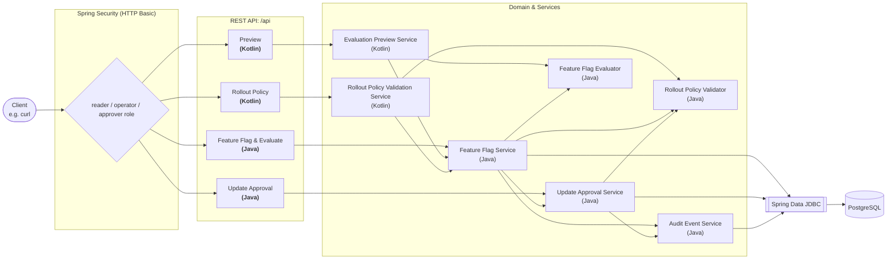
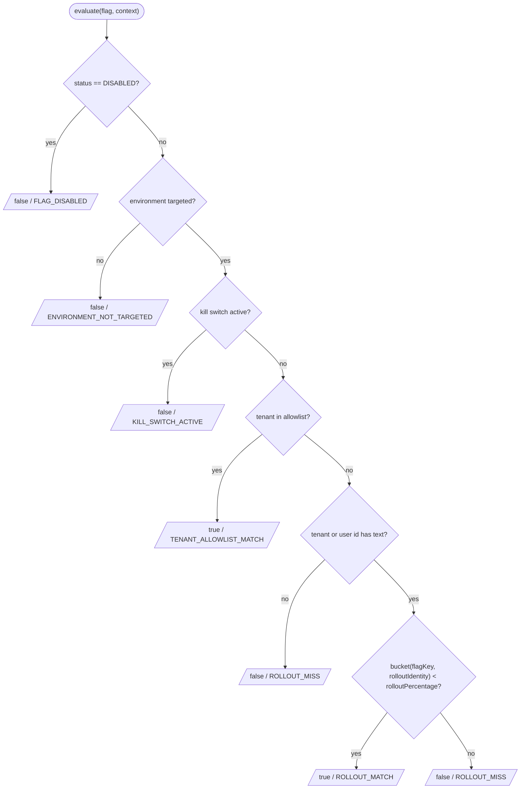
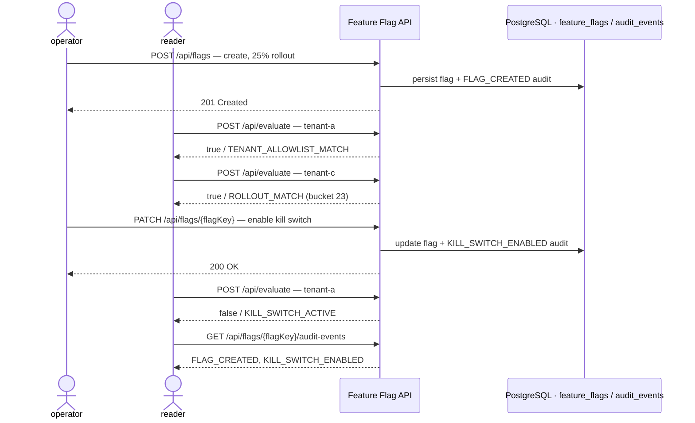

# feature-flag-expt

English | [日本語](README.ja.md)

[](https://github.com/42milez/feature-flag-expt/actions/workflows/ci.yaml)
[](https://app.codacy.com?utm_source=gh&utm_medium=referral&utm_content=&utm_campaign=Badge_grade)
[](https://app.codacy.com/gh/42milez/feature-flag-expt/dashboard?utm_source=gh&utm_medium=referral&utm_content=&utm_campaign=Badge_coverage)


[](LICENSE)

A portfolio project that takes the feature flag foundation of an internal
developer platform as its subject, built as a Spring Boot service. It combines
flag evaluation, an approval workflow, and gradual rollouts, implemented as a
foundation intended to support releases that ship features in small increments
and expand them over time. Concretely it covers environment targeting,
emergency kill switches, tenant allowlists, deterministic percentage rollouts,
an approval workflow for high-risk changes, and audit events. The repository
keeps the application, container image definition, Kubernetes manifests,
observability assets, and CI quality gates together so the platform components
that support product development can be reviewed in one place.

## :warning: Flag Evaluation Approach: Current State and Roadmap

In the current approach, the feature flag platform manages flag configuration
and evaluates flags at runtime. A calling service sends a flag key,
environment, tenant ID, and optional user ID to `POST /api/evaluate`, and uses
the returned `enabled` value to choose between the old and new behavior.

Flag evaluation runs in the feature flag platform, and callers do not yet have
a way to evaluate flags on their own side, so they call `POST /api/evaluate`
every time they need to evaluate a flag.

With this approach, every evaluation makes a network call, and callers depend on
the feature flag platform at runtime. Reducing that dependency — for example
through application-side caching or distributing flag configuration so callers
can evaluate locally — is a direction under consideration.

## Table of Contents

- [Project Focus Areas](#project-focus-areas)
- [Architecture](#architecture)
- [Tech Stack](#tech-stack)
- [Quick Start](#quick-start)
- [API Overview](#api-overview)
- [Design Decisions (ADRs)](#design-decisions-adrs)
- [Deployment & Operations](#deployment--operations)
- [Observability](#observability)
- [Development & Setup](#development--setup)
- [Repository Layout](#repository-layout)

## Project Focus Areas

- **Application design** — Java owns the persisted flag domain, evaluator, the
  approval workflow for high-risk changes, Spring Data JDBC transaction flow,
  audit recording, Micrometer metrics, and Spring Security boundary, while
  Kotlin is used only at read-oriented API boundaries where immutable DTOs are a
  good fit.
  ([ADR-0008](docs/decisions/0008-use-kotlin-for-evaluation-preview-api.md))
- **Kubernetes deployment** — Kustomize `base` and `dev` overlays deploy to
  kind and align the workload with the Pod Security Standards
  [restricted](https://kubernetes.io/docs/concepts/security/pod-security-standards/#restricted)
  profile.
  ([ADR-0009](docs/decisions/0009-use-kind-for-local-kubernetes-development-and-ci-validation.md))
- **Observability** — Actuator/Micrometer metrics, ECS JSON structured logs,
  committed Prometheus alert rules with `promtool` tests, and a Grafana
  dashboard make system state visible and monitorable.
  ([ADR-0011](docs/decisions/0011-keep-observability-stack-alerting-ready-but-local.md))
- **CI quality gates** — formatting, Error Prone, unit and Testcontainers
  tests, JaCoCo/Codacy coverage, Kubernetes render validation, OpenAPI drift
  detection, and Trivy scanning run on each change.
- **AI-agent development workflow** — AI agents support planning, design,
  implementation, and review, while the repository owner keeps the final
  merge decision grounded in the substance of the change.

### Development Approach

The typical flow is as follows (for small capabilities or clearly scoped fixes,
the roadmap step may be skipped and the work may begin with design or
implementation).

1. The owner describes the desired capability, and an AI agent drafts a roadmap
   (Markdown) organized into implementation phases.
2. Once the owner approves the roadmap, an AI agent writes a design document for
   each phase.
3. After the owner approves the design, an AI agent implements the change from
   that design.
4. The owner reviews the implementation, asking an AI agent to fix any issues
   before it is merged.

Each step also receives AI-agent peer review (for example, Codex handling design
and implementation with Claude Code reviewing it). AI review is an input to the
process, not a replacement for the owner's final judgment.

A worked example is committed under [docs/plans/](docs/plans/README.md): the
roadmap that organized a production-minded refinement into reviewable phases,
and the Phase 2 design document that advanced to implementation after AI-agent
peer review.

## Architecture

The flag domain, evaluator, persistence, update approval workflow, audit, and
security boundary are implemented in Java. Kotlin is limited to read-oriented
API boundaries such as preview and rollout-policy validation, because those
boundaries can express partial-update DTOs concisely with null-safe types and
default values while leaving the domain, persistence, and security model in
Java. The preview API models proposed changes, per-sample before/after diffs,
and summaries with nested Kotlin request/response DTOs, and reuses the Java
`FeatureFlagEvaluator`. The rollout-policy validation API uses a Kotlin
controller/service layer to assemble the current flag and proposed change, then
validates them with the Java `RolloutPolicyValidator`. The validation response
DTO is a Java record because it is shared by the validation API and the
policy-violation response from PATCH updates.



Evaluation applies the following checks in order, returning the first match as
the result `reason`:



> `bucket` reads the first four bytes of `SHA-256(flagKey + ":" + rolloutIdentity)`
> as a signed big-endian integer and reduces it with `floorMod(..., 100)` into `[0, 100)`.
> `rolloutIdentity` uses the tenant ID when present, otherwise the user ID. The
> same flag key and `rolloutIdentity` combination always lands in the same
> bucket, so the rollout is stable and deterministic rather than random per
> request.

## Tech Stack

| Area | Core | Notes |
|---|---|---|
| Language | Java 25 / Kotlin 2.3 | — |
| Framework | Spring Boot 4.1 | Web MVC · Security · Validation · Actuator |
| Persistence | Spring Data JDBC + PostgreSQL 16 | Flyway migrations |
| API docs | springdoc-openapi 3.0 | committed OpenAPI snapshot |
| Build | Gradle (multi-stage Docker build) | distroless, non-root `java25` image |
| Deploy | Kubernetes + Kustomize | kind cluster |
| Test | JUnit · Mockito・MockK · Testcontainers (PostgreSQL) | Spring Security Test |
| Quality | Spotless (google-java-format / ktfmt) · Error Prone | JaCoCo · Codacy |
| CI | GitHub Actions | Trivy · promtool |
| Observability | Micrometer + Prometheus | ECS JSON logging · Grafana |

Exact version numbers are managed in [`gradle/libs.versions.toml`](gradle/libs.versions.toml).

## Quick Start

Start the application with Docker Compose. See
[docs/development.md](docs/development.md) for prerequisites and detailed
development steps.

The walk-through below follows this path: operator and reader act at different
points, and each state-changing call leaves an audit event.



**1. Start the local Compose stack**

```bash
docker compose up --build -d
```

Compose builds the service image, including the Spring Boot jar, and starts the
app plus PostgreSQL with disposable local state.

**2. Create a flag, then evaluate it**

```bash
# Create: targets production, allowlists tenant-a, 25% rollout (operator role)
curl -u featureflags-operator:featureflags-operator \
  -H 'Content-Type: application/json' \
  -d '{"flagKey":"checkout-redesign","status":"ENABLED","targetEnvironments":["production"],"killSwitchActive":false,"tenantAllowlist":["tenant-a"],"rolloutPercentage":25}' \
  http://localhost:8080/api/flags
```

```jsonc
// 201 Created
{
  "flagKey": "checkout-redesign",
  "status": "ENABLED",
  "targetEnvironments": ["production"],
  "killSwitchActive": false,
  "tenantAllowlist": ["tenant-a"],
  "rolloutPercentage": 25
}
```

```bash
# Evaluate for production + tenant-a (reader role)
curl -u featureflags-reader:featureflags-reader \
  -H 'Content-Type: application/json' \
  -d '{"flagKey":"checkout-redesign","environment":"production","tenantId":"tenant-a"}' \
  http://localhost:8080/api/evaluate
```

```jsonc
// 200 OK — tenant-a is allowlisted, so evaluation short-circuits before the
// percentage rollout; bucket is null because rollout logic was never reached.
{
  "flagKey": "checkout-redesign",
  "enabled": true,
  "reason": "TENANT_ALLOWLIST_MATCH",
  "bucket": null
}
```

```bash
# Evaluate for production + tenant-c (outside the allowlist, inside the 25% rollout)
curl -u featureflags-reader:featureflags-reader \
  -H 'Content-Type: application/json' \
  -d '{"flagKey":"checkout-redesign","environment":"production","tenantId":"tenant-c"}' \
  http://localhost:8080/api/evaluate
```

```jsonc
// 200 OK — tenant-c is not allowlisted, but its deterministic bucket 23 is
// lower than 25, so the percentage rollout enables it.
{
  "flagKey": "checkout-redesign",
  "enabled": true,
  "reason": "ROLLOUT_MATCH",
  "bucket": 23
}
```

The `enabled`, `reason`, and `bucket` fields let a caller switch behavior
without knowing the internal structure of the flag configuration. Evaluation
reasons are also emitted to metrics and structured logs, so operators can trace
whether a decision came from the allowlist, kill switch, or gradual rollout.

**3. Trigger the emergency kill switch, then read the audit trail**

Every state change is attributed and recorded. Flip the kill switch, watch it
override evaluation, and see the same action land in the audit trail.

```bash
# Emergency stop: enable the kill switch (operator role, PATCH)
curl -u featureflags-operator:featureflags-operator -X PATCH \
  -H 'Content-Type: application/json' \
  -d '{"killSwitchActive":true}' \
  http://localhost:8080/api/flags/checkout-redesign
```

```jsonc
// 200 OK — killSwitchActive is now true; other fields are preserved by the partial update.
{
  "flagKey": "checkout-redesign",
  "status": "ENABLED",
  "targetEnvironments": ["production"],
  "killSwitchActive": true,
  "tenantAllowlist": ["tenant-a"],
  "rolloutPercentage": 25
}
```

```bash
# Re-evaluate the allowlisted tenant-a (reader role)
curl -u featureflags-reader:featureflags-reader \
  -H 'Content-Type: application/json' \
  -d '{"flagKey":"checkout-redesign","environment":"production","tenantId":"tenant-a"}' \
  http://localhost:8080/api/evaluate
```

```jsonc
// 200 OK — the kill switch is checked before the allowlist, so even allowlisted
// tenant-a is turned off.
{
  "flagKey": "checkout-redesign",
  "enabled": false,
  "reason": "KILL_SWITCH_ACTIVE",
  "bucket": null
}
```

```bash
# Inspect the audit trail (reader role, oldest first)
curl -u featureflags-reader:featureflags-reader \
  http://localhost:8080/api/flags/checkout-redesign/audit-events
```

```jsonc
// 200 OK — every change is recorded with the authenticated actor; details vary by eventType.
[
  {
    "id": 1,
    "flagKey": "checkout-redesign",
    "eventType": "FLAG_CREATED",
    "actor": "featureflags-operator",
    "details": { /* ... */ },
    "occurredAt": "2026-..."
  },
  {
    "id": 2,
    "flagKey": "checkout-redesign",
    "eventType": "KILL_SWITCH_ENABLED",
    "actor": "featureflags-operator",
    "details": {
      "field": "killSwitchActive",
      "oldValue": false,
      "newValue": true
    },
    "occurredAt": "2026-..."
  }
]
```

The `actor` is taken from the authenticated principal, not the request body, so
the trail cannot be forged. Higher-risk changes — expanding production exposure
or raising a production rollout by 50 points or more — go through the approval
workflow instead (an operator requests, an approver decides); the
[approval workflow walkthrough](docs/development.md#quick-start-full)
has a runnable example. Browse every endpoint interactively at
**`http://localhost:8080/swagger-ui.html`**.

**4. Stop the local stack**

```bash
docker compose down
```

## API Overview

| Method | Path | Role | Purpose | Impl |
|---|---|---|---|---|
| `POST` | `/api/flags` | operator | Create a flag | Java |
| `GET` | `/api/flags/{flagKey}` | reader / operator | Get a flag | Java |
| `PATCH` | `/api/flags/{flagKey}` | operator | Update a flag | Java |
| `POST` | `/api/flags/{flagKey}/approval-requests` | operator | Request approval for a high-risk update | Java |
| `GET` | `/api/flags/{flagKey}/approval-requests/{approvalId}` | operator / approver | Get an approval request | Java |
| `POST` | `/api/flags/{flagKey}/approval-requests/{approvalId}/approve` | approver | Approve an update request | Java |
| `POST` | `/api/flags/{flagKey}/approval-requests/{approvalId}/reject` | approver | Reject an update request | Java |
| `POST` | `/api/evaluate` | reader / operator | Evaluate a flag for a context | Java |
| `GET` | `/api/flags/{flagKey}/audit-events` | reader / operator | List audit events | Java |
| `POST` | `/api/flags/{flagKey}/preview` | reader / operator | Preview a proposed change | Kotlin |
| `POST` | `/api/flags/{flagKey}/validate-change` | reader / operator | Validate a proposed change against rollout policy | Kotlin |

**Operational endpoints**

| Path | Access |
|---|---|
| `/actuator/health` (`/liveness`, `/readiness`) | Public (probes) |
| `/actuator/prometheus` | Authenticated |
| `/swagger-ui.html`, `/v3/api-docs(.yaml)` | Public |
| any other `/api/**` | Denied (fail closed) |

The raw OpenAPI spec is served at `/v3/api-docs` (JSON) and `/v3/api-docs.yaml`
(YAML); a static snapshot is committed at [docs/openapi.yaml](docs/openapi.yaml).

## Design Decisions (ADRs)

Significant decisions are recorded as
[Architecture Decision Records](docs/decisions/README.md) in MADR v4 format.
Representative ADRs are listed below.

- [ADR-0002](docs/decisions/0002-use-spring-data-jdbc-instead-of-jpa.md) — Spring Data JDBC instead of JPA/Hibernate
- [ADR-0009](docs/decisions/0009-use-kind-for-local-kubernetes-development-and-ci-validation.md) — kind for local Kubernetes and CI validation
- [ADR-0010](docs/decisions/0010-use-http-basic-for-local-portfolio-security-boundary.md) — HTTP Basic for the local security boundary

See the [full index](docs/decisions/README.md) for all records.

## Deployment & Operations

Detailed local run and development instructions live in
[docs/development.md](docs/development.md).

### Continuous Integration

GitHub Actions uses three workflows:

| Workflow | Trigger | Coverage |
|---|---|---|
| `CI` | Pushes to `main`, pull requests, manual dispatch | Secret scanning, formatting, Error Prone compilation, unit tests, Testcontainers integration tests, JaCoCo coverage report generation, Kubernetes render validation, OpenAPI snapshot drift detection, Prometheus alert rule validation |
| `Image Vulnerability Scan` | Pushes to `main`, pull requests, daily at 18:00 UTC (03:00 JST), manual dispatch | Service image buildability and Trivy image scanning, kept separate from test and deploy signals |
| `Kind Smoke Test` | Daily at 18:00 UTC (03:00 JST), manual dispatch | Cluster startup verification in kind, collecting Kubernetes diagnostics when any step fails |

CI validates Prometheus alert rules with `promtool` without running a
Prometheus server. The image workflow builds the service image locally and
scans that exact image with Trivy.

Codacy is included for coverage visibility, feedback on code issues, and
related review signals. Spotless remains the formatting authority, Error Prone
remains the compile-time Java static analysis gate, and Trivy continues to
cover repository secret scanning and built-image vulnerability scanning.

<details>
<summary>Vulnerability gate behavior</summary>

The Trivy gate fails on **fixed** high or critical OS and library
vulnerabilities while excluding unfixed findings from the failure condition. It
also publishes a non-blocking job summary that includes unfixed high/critical
findings, so reviewers can see risks that do not fail the gate. Scheduled runs
can fail when new CVEs are published, even without application code changes.

</details>

### Security

API access uses three local HTTP Basic users:

| User | Role / permissions |
| --- | --- |
| **reader** | Read-style operations |
| **operator** | Create, update, approval-request creation, and requester-owned approval reads |
| **approver** | Approval decisions and approval status reads |

Prometheus metrics require any configured user; Swagger UI and OpenAPI docs stay
public so the portfolio can be explored locally. Audit events record the
authenticated principal as `actor`.

<details>
<summary>Security model scope and evolution</summary>

HTTP Basic is a local portfolio baseline. User credentials are intentionally
kept out of the application database; PostgreSQL is reserved for flag state,
rollout configuration, validation behavior, and audit events.
Route-to-authority mappings are kept hardcoded in `SecurityConfig` so the
security boundary stays easy to inspect without extra indirection. CSRF token
handling is disabled because the API is meant to be consumed as a stateless
JSON API (for example from curl) rather than through browser sessions.
[ADR-0010](docs/decisions/0010-use-http-basic-for-local-portfolio-security-boundary.md)
documents the browser-client trade-off and the production direction of
replacing Basic with OIDC or another organization-managed identity provider.

</details>

### Runtime hardening

The workload aligns with the Pod Security Standards [restricted](https://kubernetes.io/docs/concepts/security/pod-security-standards/#restricted) profile:

- Non-root user and group, no service account token mount
- Read-only root filesystem with a bounded writable `/tmp` volume
- All Linux capabilities dropped, RuntimeDefault seccomp
- Resource limits, health probes, and graceful shutdown

<details>
<summary>Hardening scope and production caveats</summary>

The kind and Kustomize workflow validates the declarative deployment path and
smoke-tests startup behavior; it is not a complete production cluster security
model. Under real production traffic, Kubernetes endpoint removal and SIGTERM
delivery can still race. If the platform needs extra time for endpoint removal
to propagate, consider environment-specific mitigations, such as a short
`preStop` wait.

</details>

<details>
<summary>Why a single repository?</summary>

Application code, manifests, the observability stack, and CI all live in one
repository so the validation path stays reviewable end to end, without depending
on a second repository. In a production system, deployment configuration would
typically live in a separate config repository reconciled by a GitOps controller
such as Argo CD — enabling an independent deploy cadence, tighter access
control over cluster-affecting changes, and least-privilege credentials that
keep cluster write access out of application CI. For this portfolio scope, the
trade-off favors a compact, whole-picture example over that release-boundary
separation.

</details>

## Observability

Actuator health endpoints are public for probes, while Prometheus metrics
require HTTP Basic credentials from any configured user. See
[docs/observability.md](docs/observability.md) for metric names, structured
logging, Prometheus and Grafana artifacts, sample traffic commands, and the
manual refresh steps after changing rules or dashboards.

The observability stack is intentionally scoped to a self-contained local
setup that can validate alerting end to end (see
[ADR-0011](docs/decisions/0011-keep-observability-stack-alerting-ready-but-local.md)).
A production deployment would add notification routing, persistent metrics
retention, and cluster-wide log collection on top of it.

## Development & Setup

Full local setup instructions live in [docs/development.md](docs/development.md):
prerequisites, the detailed Compose quick start, environment variables, kind
deployment, direct JVM development on the host, static analysis, tests, and
Repomix review packs.

## Repository Layout

```text
.
├── service/                                 # Spring Boot service (Java + Kotlin)
│   └── src/main/.../featureflags/
│       ├── flags/                           # Flag domain, evaluator, persistence (Java + Kotlin)
│       ├── audit/                           # Audit events (Java)
│       ├── approval/                        # Update approval workflow (Java)
│       ├── policy/                          # Rollout policy: validation logic Java, API Kotlin
│       ├── preview/                         # Preview: evaluator Java, API Kotlin
│       ├── observability/                   # Metrics instrumentation (Java)
│       ├── error/                           # Global error handling (Java)
│       └── SecurityConfig, ...
├── deploy/
│   ├── k8s/base/                            # App (Deployment + Service) + Namespace
│   ├── k8s/overlays/dev/                    # kind: in-cluster PostgreSQL, local config
│   ├── k8s/overlays/dev-observability/      # Prometheus + Grafana + alert rules
│   └── kind/cluster.yaml
├── compose.yaml                             # Local runtime with Docker Compose (app + PostgreSQL)
├── docs/
│   ├── decisions/                           # ADRs
│   ├── development.md                       # Local run and development reference (English)
│   ├── development.ja.md                    # Local run and development reference (Japanese)
│   ├── observability.md                     # Observability reference
│   ├── runtime-safety.md                    # JVM runtime safety baseline
│   ├── openapi.yaml                         # OpenAPI snapshot
│   └── notes/, issues/, plans/, references/ # Design and implementation working notes
├── scripts/                                 # Shell equivalents of the kind/k8s Gradle tasks
├── .github/workflows/                       # CI · image scan · kind smoke test
└── build-logic/                             # Gradle convention plugins
```
