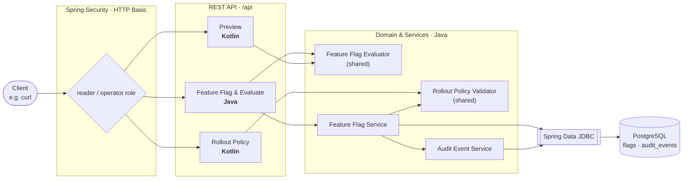
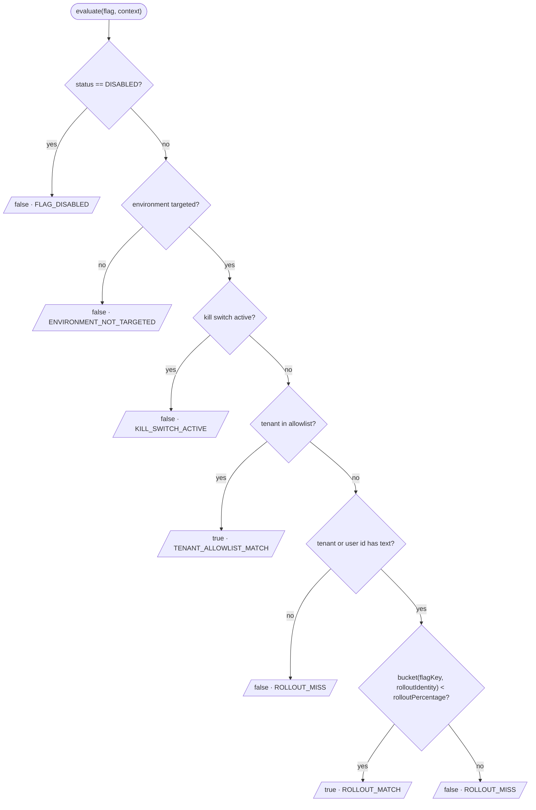

# feature-flag-expt

English | [日本語](README.ja.md)

[](https://github.com/42milez/feature-flag-expt/actions/workflows/ci.yaml)
[](https://app.codacy.com?utm_source=gh&utm_medium=referral&utm_content=&utm_campaign=Badge_grade)
[](https://app.codacy.com?utm_source=gh&utm_medium=referral&utm_content=&utm_campaign=Badge_coverage)


[](LICENSE)

A portfolio project built around a Spring Boot feature-flag platform service:
the kind of internal developer platform component that helps product teams
release changes safely through environment targeting, emergency kill switches,
tenant allowlists, deterministic percentage rollouts, and audit events. The
repository keeps the application, container image definition, Kubernetes
manifests, observability assets, and CI quality gates together so the
operational platform components that support product development can be
reviewed in one place.

## Table of Contents

- [Project Focus Areas](#project-focus-areas)
- [Development Approach](#development-approach)
- [Architecture](#architecture)
- [Tech Stack](#tech-stack)
- [Quick Start](#quick-start)
- [API Overview](#api-overview)
- [Design Decisions (ADRs)](#design-decisions-adrs)
- [Deployment & Operations](#deployment--operations)
- [Observability](#observability)
- [Development & Setup](#development--setup)
- [Repository Layout](#repository-layout)

## Project Focus Areas

- **JVM service design** — Java owns the persisted flag domain, evaluator,
  Spring Data JDBC transaction flow, audit recording, Micrometer metrics, and
  Spring Security boundary, while Kotlin is used only at read-oriented API
  boundaries where immutable DTOs are a good fit.
  ([ADR-0008](docs/decisions/0008-use-kotlin-for-evaluation-preview-api.md))
- **Fail-closed security boundary** — local HTTP Basic reader/operator roles
  expose only probes and API docs publicly, classify known `/api/**` routes by
  role, and deny unclassified API routes by default.
  ([ADR-0010](docs/decisions/0010-use-http-basic-for-local-portfolio-security-boundary.md))
- **Kubernetes deployment** — Kustomize `base` and `dev` overlays deploy to
  kind and align the workload with the Pod Security Standards
  [restricted](https://kubernetes.io/docs/concepts/security/pod-security-standards/#restricted)
  profile.
  ([ADR-0009](docs/decisions/0009-use-kind-for-local-kubernetes-development-and-ci-validation.md))
- **Observability** — Actuator/Micrometer metrics, ECS JSON structured logs,
  committed Prometheus alert rules with `promtool` tests, and a Grafana
  dashboard make the local system inspectable.
  ([ADR-0011](docs/decisions/0011-keep-observability-stack-alerting-ready-but-local.md))
- **CI quality gates** — formatting, Error Prone, unit and Testcontainers
  tests, JaCoCo/Codacy coverage, Kubernetes render validation, OpenAPI drift
  detection, `promtool`, and Trivy scanning run on each change.
- **AI-agent development workflow** — AI agents support planning, design,
  implementation, and review, while the repository owner keeps the final
  merge decision grounded in the substance of the change.

## Development Approach

This repository is developed through a human-directed AI-agent workflow. The
owner defines the product intent, reviews decisions and implementation details,
and approves merges; AI agents assist with planning, design, implementation,
and review.

The typical flow is:

For small capabilities or clearly scoped fixes, the roadmap step may be skipped
and the work may begin with design or implementation.

1. The owner describes the desired capability, and an AI agent drafts a roadmap
   (Markdown) that organizes it into multiple implementation phases.
2. Once the owner approves the roadmap, an AI agent creates a design document
   (Markdown) for each phase.
3. After the owner approves the design, an AI agent implements the change from
   that design.
4. The owner reviews the implementation.
5. If issues are found, the owner asks an AI agent to fix them; otherwise it is
   merged.

Steps 1 through 4 also receive AI-agent peer review, for example with Codex
handling design or implementation and Claude Code reviewing it. The
main review lenses are whether the work follows modern 2026-era practices, is
secure in design and implementation, and avoids obvious over-engineering. AI
review is an input to the process, not a replacement for the owner's final
judgment.

A worked example of this flow is committed under [docs/plans/](docs/plans/README.md): the roadmap
that organized a past refinement of the codebase into reviewable phases, and the design document for
that roadmap's Phase 2, produced by one AI agent and reviewed by another before implementation.

## Architecture

The flag domain, evaluator, persistence, and audit behavior are implemented in
Java. Kotlin is limited to read-oriented API boundaries such as preview and
rollout-policy validation, where null-safe types and default values express
DTOs concisely. The preview API models proposed changes, per-sample
before/after diffs, and summaries with nested Kotlin request/response DTOs, and
reuses the Java `FeatureFlagEvaluator`. The rollout-policy validation API uses
a Kotlin controller/service layer to assemble the current flag and proposed
change, then validates them with the Java `RolloutPolicyValidator`. The
validation response DTO is a Java record because it is shared by the validation
API and the policy-violation response from PATCH updates.



Evaluation applies the following checks in order, returning the first match as
the result `reason`:



> `bucket` is `floorMod(SHA-256(flagKey + ":" + rolloutIdentity), 100)`.
> `rolloutIdentity` uses the tenant ID when present, otherwise the user ID. The
> same flag key and `rolloutIdentity` combination always lands in the same
> bucket, so the rollout is stable and deterministic rather than random per
> request.

## Tech Stack

| Area | Technology |
|---|---|
| Language | Java 25 (toolchain), Kotlin 2.3 |
| Framework | Spring Boot 4.0 — Web MVC, Security, Validation, Actuator |
| Persistence | Spring Data JDBC + PostgreSQL, Flyway migrations |
| API docs | springdoc-openapi 3.0 (code-first), committed OpenAPI snapshot |
| Observability | Micrometer + Prometheus, ECS JSON logging, Grafana |
| Build | Gradle inside a multi-stage Docker build → distroless `java25` image |
| Quality | Spotless (google-java-format, ktfmt), Error Prone, JaCoCo, Codacy |
| Test | JUnit, MockK, Testcontainers (PostgreSQL), Spring Security Test |
| Deploy | Docker (distroless, non-root), Kubernetes + Kustomize, kind |
| CI | GitHub Actions, Trivy, promtool |

Exact patch versions are managed in [`gradle/libs.versions.toml`](gradle/libs.versions.toml).

## Quick Start

Create and evaluate a flag with Docker Compose; a host JDK is not required.
See [docs/development.md](docs/development.md) for prerequisites, port-conflict
notes, kind, and host JVM workflows.

**1. Start the local Compose stack**

```bash
docker compose up --build -d
```

Compose builds the service image, including the Spring Boot jar, and starts the
app plus PostgreSQL with disposable local state.

**2. Create a flag, then evaluate it**

```bash
# Create: targets production, allowlists tenant-a, 25% rollout (operator role)
curl -u featureflags-operator:featureflags-operator \
  -H 'Content-Type: application/json' \
  -d '{"flagKey":"checkout-redesign","status":"ENABLED","targetEnvironments":["production"],"killSwitchActive":false,"tenantAllowlist":["tenant-a"],"rolloutPercentage":25}' \
  http://localhost:8080/api/flags
```

```jsonc
// 201 Created
{ "flagKey": "checkout-redesign", "status": "ENABLED",
  "targetEnvironments": ["production"], "killSwitchActive": false,
  "tenantAllowlist": ["tenant-a"], "rolloutPercentage": 25 }
```

```bash
# Evaluate for production + tenant-a (reader role)
curl -u featureflags-reader:featureflags-reader \
  -H 'Content-Type: application/json' \
  -d '{"flagKey":"checkout-redesign","environment":"production","tenantId":"tenant-a"}' \
  http://localhost:8080/api/evaluate
```

```jsonc
// 200 OK — tenant-a is allowlisted, so evaluation short-circuits before the
// percentage rollout; bucket is null because rollout logic was never reached.
{ "flagKey": "checkout-redesign", "enabled": true,
  "reason": "TENANT_ALLOWLIST_MATCH", "bucket": null }
```

The `enabled` and `reason` fields let a caller switch behavior without knowing
the internal structure of the flag configuration. Browse every endpoint
interactively at **`http://localhost:8080/swagger-ui.html`**.

**3. Stop the local stack**

```bash
docker compose down --remove-orphans
```

## API Overview

| Method | Path | Role | Purpose | Impl |
|---|---|---|---|---|
| `POST` | `/api/flags` | operator | Create a flag (rollout policy enforced) | Java |
| `GET` | `/api/flags/{flagKey}` | reader / operator | Get a flag | Java |
| `PATCH` | `/api/flags/{flagKey}` | operator | Update a flag (rollout policy enforced) | Java |
| `POST` | `/api/evaluate` | reader / operator | Evaluate a flag for a context | Java |
| `GET` | `/api/flags/{flagKey}/audit-events` | reader / operator | List audit events (oldest first) | Java |
| `POST` | `/api/flags/{flagKey}/preview` | reader / operator | Preview a proposed change (diff, no write) | Kotlin |
| `POST` | `/api/flags/{flagKey}/validate-change` | reader / operator | Validate a proposed change against rollout policy | Kotlin |

**Operational endpoints**

| Path | Access |
|---|---|
| `/actuator/health` (`/liveness`, `/readiness`) | Public (probes) |
| `/actuator/prometheus` | Authenticated (any local user) |
| `/swagger-ui.html`, `/v3/api-docs(.yaml)` | Public |
| any other `/api/**` | Denied (fail closed) |

The raw OpenAPI spec is served at `/v3/api-docs` (JSON) and `/v3/api-docs.yaml`
(YAML); a static snapshot is committed at [docs/openapi.yaml](docs/openapi.yaml).

## Design Decisions (ADRs)

Significant decisions are recorded as
[Architecture Decision Records](docs/decisions/README.md) in MADR v4 format.
Highlights:

- [ADR-0002](docs/decisions/0002-use-spring-data-jdbc-instead-of-jpa.md) — Spring Data JDBC instead of JPA/Hibernate
- [ADR-0005](docs/decisions/0005-separate-domain-records-from-persistence-entities.md) — Separate domain records from persistence entities
- [ADR-0008](docs/decisions/0008-use-kotlin-for-evaluation-preview-api.md) — Kotlin for the evaluation preview API
- [ADR-0009](docs/decisions/0009-use-kind-for-local-kubernetes-development-and-ci-validation.md) — kind for local Kubernetes and CI validation
- [ADR-0010](docs/decisions/0010-use-http-basic-for-local-portfolio-security-boundary.md) — HTTP Basic for the local security boundary

See the [full index](docs/decisions/README.md) for all records.

## Deployment & Operations

Local configuration values, kind commands, and host development workflows live
in [docs/development.md](docs/development.md).

### Continuous Integration

GitHub Actions uses three workflows:

| Workflow | Trigger | Coverage |
|---|---|---|
| `CI` | Pushes to `main`, pull requests, manual dispatch | Formatting, Error Prone compilation, unit tests, Testcontainers integration tests, JaCoCo coverage report generation, Kubernetes render validation, OpenAPI snapshot drift detection, Prometheus alert rule validation |
| `Image Vulnerability Scan` | Pushes to `main`, pull requests, daily at 18:00 UTC (03:00 JST), manual dispatch | Service image buildability and Trivy image scanning, kept separate from test and deploy signals |
| `Kind Smoke Test` | Daily at 18:00 UTC (03:00 JST), manual dispatch | Cluster startup verification in kind, with Kubernetes failure diagnostics on deploy failure |

Pull request CI validates Prometheus alert rules with `promtool` without running
a Prometheus server. The image workflow builds the service image locally and
scans that exact image with Trivy.

Codacy is included for coverage visibility, feedback on code issues, and
related review signals. Spotless remains the formatting authority, Error Prone
remains the compile-time Java static analysis gate, and Trivy continues to
cover repository secret scanning and built-image vulnerability scanning.

<details>
<summary>Vulnerability gate behavior</summary>

The Trivy gate fails on **fixed** high or critical OS and library
vulnerabilities while excluding unfixed findings from the failure condition. It
also publishes a non-blocking job summary that includes unfixed high/critical
findings, so reviewers can see risks that do not fail the gate. Scheduled runs
can fail when new CVEs are published, even without application code changes.

</details>

### Security

API access uses two local HTTP Basic users: a **reader** for read-style
operations and an **operator** for create and update operations. Prometheus
metrics require any configured user; Swagger UI and OpenAPI docs stay public so
the portfolio can be explored locally. Audit events record the authenticated
principal as `actor`.

<details>
<summary>Security model scope and evolution</summary>

HTTP Basic is a local portfolio baseline. User credentials are intentionally
kept out of the application database; PostgreSQL is reserved for flag state,
rollout configuration, validation behavior, and audit events.
Route-to-authority mappings are kept hardcoded in `SecurityConfig` so the
security boundary stays easy to inspect without extra indirection. CSRF token
handling is disabled for the local stateless JSON API, and
[ADR-0010](docs/decisions/0010-use-http-basic-for-local-portfolio-security-boundary.md)
documents the browser-client trade-off and the production direction of
replacing Basic with OIDC or another organization-managed identity provider.

</details>

### Runtime hardening

The workload aligns with the Pod Security Standards [restricted](https://kubernetes.io/docs/concepts/security/pod-security-standards/#restricted) profile:

- Non-root user and group, no service account token mount
- Read-only root filesystem with a bounded writable `/tmp` volume
- All Linux capabilities dropped, RuntimeDefault seccomp
- Resource limits, health probes, and graceful shutdown

<details>
<summary>Hardening scope and production caveats</summary>

The kind and Kustomize workflow validates the declarative deployment path and
smoke-tests startup behavior; it is not a complete production cluster security
model. In real production traffic, Kubernetes endpoint removal can still race
with SIGTERM delivery, so a rollout could add a short `preStop` delay if the
platform needs extra endpoint-propagation time.

</details>

<details>
<summary>Why a single repository?</summary>

Application code, manifests, the observability stack, and CI all live in one
repository so the validation path stays reviewable end to end, without depending
on a second repository. In a production system, deployment configuration would
typically live in a separate config repository reconciled by a GitOps controller
such as Argo CD or Flux — enabling an independent deploy cadence, tighter access
control over cluster-affecting changes, and least-privilege credentials that
keep cluster write access out of application CI. For this portfolio scope, the
trade-off favors a compact, whole-picture example over that release-boundary
separation.

</details>

## Observability

Actuator health endpoints are public for probes, while Prometheus metrics
require HTTP Basic credentials from any configured user. See
[docs/observability.md](docs/observability.md) for metric names, structured
logging, Prometheus and Grafana artifacts, sample traffic commands, and the
manual refresh steps after changing rules or dashboards.

The committed alert rules and tests are intentionally alerting-ready local
artifacts, not a production Alertmanager, PagerDuty, or Grafana provisioning
stack (see
[ADR-0011](docs/decisions/0011-keep-observability-stack-alerting-ready-but-local.md)).
The overlay deliberately stops at stdout/stderr logs and a small
Prometheus/Grafana stack; it does not install cluster-level log collection. A
production deployment would select log collection, routing, retention, and
access-control middleware based on the target platform.

## Development & Setup

Full local setup instructions live in [docs/development.md](docs/development.md):
prerequisites, the detailed Compose quick start, environment variables, kind
deployment, host JVM development, static analysis, tests, and Repomix review
packs.

## Repository Layout

```text
.
├── service/                            # Spring Boot service (Java + Kotlin)
│   └── src/main/.../featureflags/
│       ├── flags/                      # Flag domain, evaluator, persistence (Java)
│       ├── audit/                      # Audit events (Java)
│       ├── policy/                     # Rollout policy: validator Java, API/service Kotlin
│       ├── preview/                    # Preview API (Kotlin)
│       └── SecurityConfig, ...
├── deploy/
│   ├── k8s/base/                       # App Deployment + Service
│   ├── k8s/overlays/dev/               # kind: in-cluster PostgreSQL, local config
│   ├── k8s/overlays/dev-observability/ # Prometheus + Grafana + alert rules
│   └── kind/cluster.yaml
├── compose.yaml                        # Local Docker Compose app + PostgreSQL runtime
├── docs/
│   ├── decisions/                      # ADRs (MADR v4)
│   ├── development.md                  # Local run and development reference (English)
│   ├── development.ja.md               # Local run and development reference (Japanese)
│   ├── observability.md
│   └── openapi.yaml                    # Committed OpenAPI snapshot
├── scripts/                            # Shell equivalents of the kind/k8s Gradle tasks
├── .github/workflows/                  # CI · image scan · kind smoke test
└── build-logic/                        # Gradle convention plugins
```
